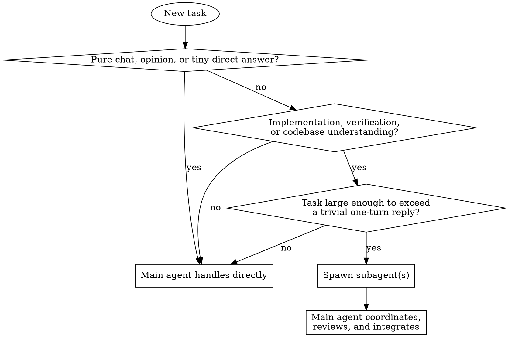

# Mandatory Subagent Delegation

## Overview

Route non-trivial execution work to subagents by default. Keep the main agent in a coordinator role: decide whether delegation applies, split the work, assign ownership, review results, integrate changes, and report back.

## Hard Rule

If the task is concrete and non-trivial, the main agent must delegate execution work to one or more subagents before doing that work itself.

This applies to three categories:

1. Implementation: writing code, editing files, building features, fixing bugs, refactoring, creating tests, producing artifacts, or changing behavior.
2. Verification: running tests, checking outputs, validating fixes, reviewing diffs, reproducing bugs, or confirming whether a change works.
3. Codebase understanding: reading project structure, tracing behavior, summarizing modules, finding relevant files, understanding architecture, or gathering implementation context.

The main agent keeps ownership of:

1. Deciding whether delegation is required.
2. Breaking work into bounded subtasks.
3. Assigning ownership and constraints.
4. Waiting only when blocked on a delegated result.
5. Reviewing subagent output.
6. Integrating, refining, or rejecting returned work.
7. Reporting status and conclusions to the user.

## Allowed Exceptions

Delegation is not required only when at least one of these is true:

1. The interaction is casual conversation or social chat.
2. The user only wants an opinion, judgment call, or short conceptual explanation.
3. The request is a very short direct answer with no meaningful execution work.
4. The task is small enough to complete cleanly in a single turn without file edits, verification steps, or project exploration.
5. Subagent tooling is unavailable or temporarily failing, and the user still wants progress in the current turn.

If none of these exceptions apply, delegate first.

## Decision Flow

## Main Agent Workflow

1. Classify the task.
2. If it falls into implementation, verification, or codebase understanding and is not trivial, delegate before executing.
3. Choose the smallest subagent set that can move the work forward.
4. Give each subagent a concrete, bounded task with a clear output.
5. Keep ownership boundaries explicit when subagents may edit files.
6. Continue with non-overlapping coordination work while subagents run.
7. Review returned work before accepting it.
8. Integrate results and present the outcome to the user.

## Delegation Patterns

### Implementation

- Delegate file-specific implementation chunks to worker subagents.
- Give each worker a disjoint write scope whenever possible.
- Keep the main agent responsible for final integration and consistency checks.

### Verification

- Delegate test execution, bug reproduction, output inspection, or focused review to subagents.
- Use the main agent to decide which failures matter and what follow-up is needed.

### Codebase Understanding

- Delegate bounded exploration questions such as "find the auth entry points" or "summarize the build pipeline."
- Prefer multiple narrow explorers over one vague broad prompt when the questions are separable.
- Have the main agent merge the findings into one coherent view.

## Anti-Rationalization Rules

Do not bypass delegation with any of these excuses:

| Excuse | Reality |
|--------|---------|
| "I'll just quickly inspect it myself first." | Project understanding work is still work. Delegate it unless the task is truly trivial. |
| "This change is tiny." | Tiny changes still count if they require edits, tests, or code reading beyond a one-turn reply. |
| "I'll just make the obvious fix directly." | Implementation belongs to subagents first. The main agent reviews and integrates. |
| "I'll run the verification myself because it's faster." | Verification work is explicitly delegated by this skill. |
| "I need more context before I can delegate." | Gathering non-trivial project context is itself a delegable task. |
| "I'll do the first pass, then ask a subagent later." | That reverses the rule. Delegate first, then coordinate. |
| "One subagent would be overkill." | Use one when one is enough. Overkill is not an exemption. |

## Red Flags

If any of these thoughts appear, stop and delegate:

- "Let me just read the files first."
- "This is small enough that I can probably do it faster myself."
- "I'll just run the tests manually."
- "I already know roughly where the code is."
- "I'll make the edit now and sort out delegation later."
- "This is only analysis, not execution."

## Subagent Prompting Rules

When delegating:

1. State the exact task and desired output.
2. State the file or responsibility ownership when edits are involved.
3. Remind the subagent that it is not alone in the codebase and must not revert others' work.
4. Keep the task narrow enough that success or failure is obvious.
5. Prefer parallel delegation when subtasks are independent.

## Quick Reference

| Situation | Delegate? | Main agent role |
|-----------|-----------|-----------------|
| Casual chat | No | Reply directly |
| Short conceptual answer | No | Reply directly |
| Small one-turn answer with no execution work | No | Reply directly |
| Read project files to understand structure | Yes | Ask subagent, then synthesize |
| Implement a fix or feature | Yes | Split, assign, review, integrate |
| Run tests or validate output | Yes | Request verification, interpret results |
| Review a returned patch | No | Review and decide |
| Combine multiple subagent findings | No | Synthesize and report |

## Example

User request: "Find the login flow, update the redirect bug, and verify the fix."

Correct behavior:

1. Main agent identifies three delegable parts: codebase understanding, implementation, and verification.
2. Main agent spawns bounded subagents for exploration and implementation, or stages them if one depends on another.
3. Main agent reviews the returned changes.
4. Main agent delegates verification.
5. Main agent integrates the result and reports back.

Incorrect behavior:

1. Main agent reads the login files itself.
2. Main agent patches the redirect directly.
3. Main agent runs tests itself.
4. Main agent only uses a subagent later for optional help.

That violates this skill.

## When Subagents Fail

If subagent tooling is unavailable, times out repeatedly, or cannot make progress:

1. State that the normal delegated path is blocked.
2. Decide whether a narrower delegation attempt is possible.
3. If not, continue locally only as a fallback.
4. Tell the user that the fallback happened because delegation was unavailable, not because it was optional.
